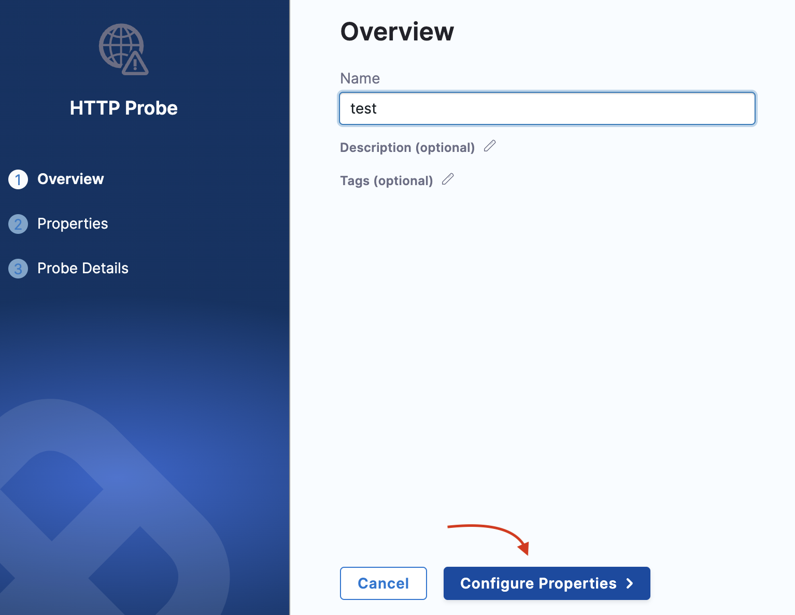
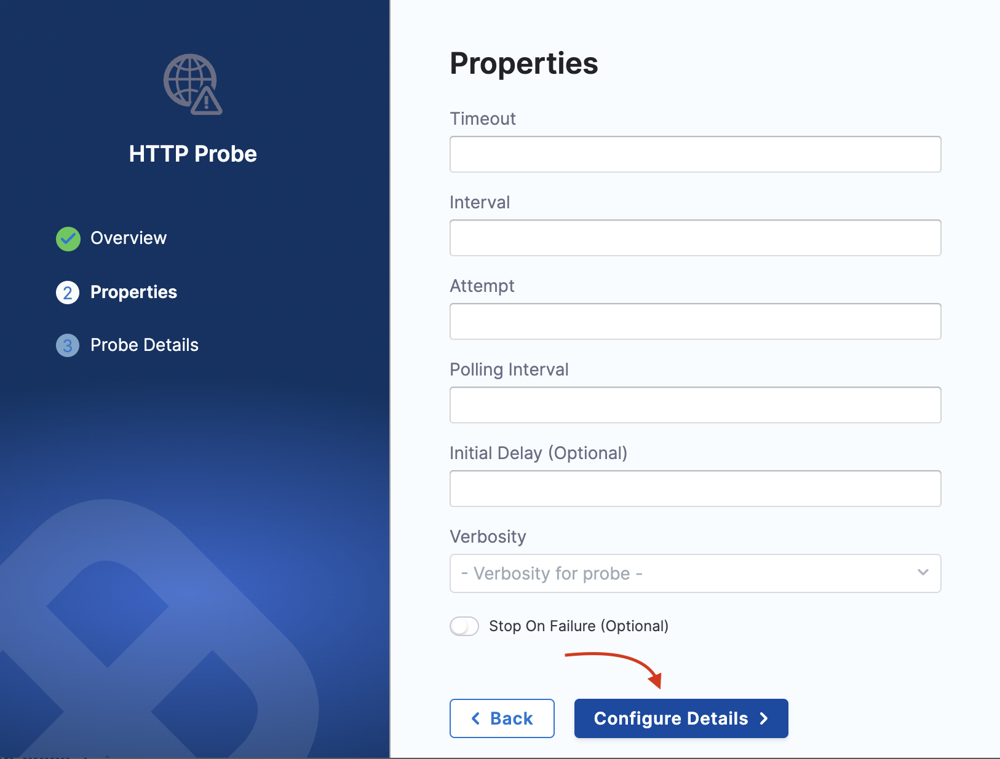
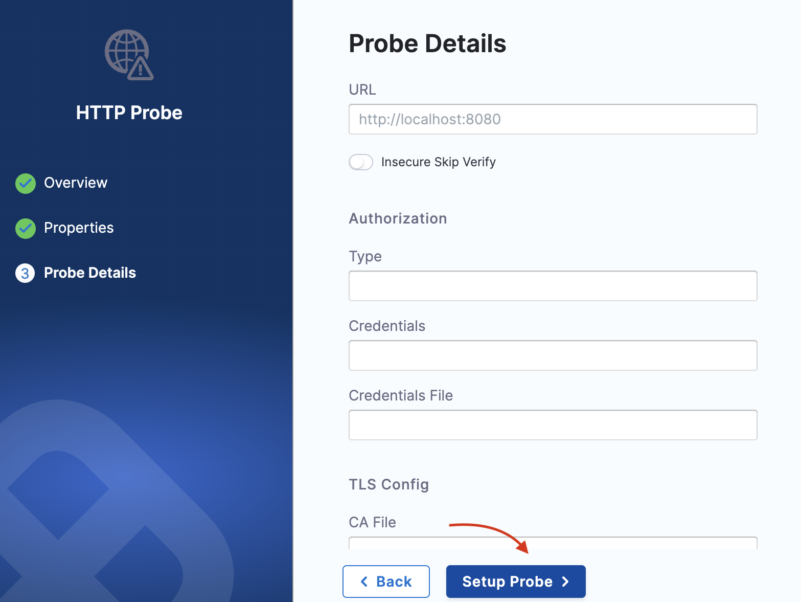
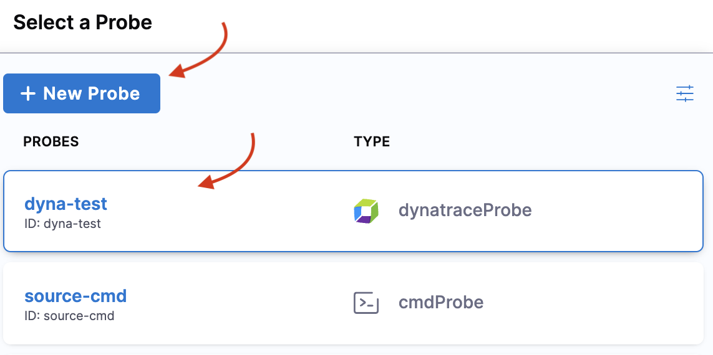

This section describes steps you can follow to create and use a resilience probe in your chaos experiment.

## Before you begin

* [Introduction to probes](/docs/chaos-engineering/technical-reference/resilience-probes/introduction)

## Create a resilience probe

### Step 1: Navigate to resilience probes

* Select the **Chaos** module and navigate to **Resilience probes**.

  

* Click **New probe**

  

### Step 2: Select probe and enter details

* Select the desired infrastructure (Kubernetes or Linux) and the probe type.

  

* Based on the probe type you choose, the fields will vary. You can find details about every probe in their respective documentation. After you enter the details, click **Configure properties**.

  

* Enter further details and click **Configure details**.

  

* Enter URL, authorization type, and click **Setup Probe**. Click **Confirm** when the screen prompts you to confirm creating the probe with specified details.

  

:::tip
If you are a first time user, you can create a resilience probe directly from Chaos Studio drawer (from within an experiment). For this, you will see an option to add a system probe (which is a health check system probe) as a one click button. This will not be present if you have configured atleast one resilience probe. 
:::

## Edit a resilience probe

* You can edit a resilience probe by navigating to the probe you wish to edit. Click the three vertical dot menu to the extreme right of the probe, and choose **Edit probe**. Modify the properties you wish to, and click **Save**.

  

## Use a resilience probe

### Step 1: Navigate to chaos experiment

* Navigate to the chaos experiment for wish you wish to set up probe/s. Move to **probes** tab and click **+Select or Add new probes**.

  

### Step 2: Select or create probe

* You can choose to [create a new probe](#create-a-resilience-probe) or add a probe that you created earlier.

  

### Step 2: Add to fault

* Once you select a probe, click **Add to Fault** to associate the resilience probe with a chaos fault.

  

* Click **Apply changes** or continue to add or create probes based on your requirement.

  

## Next steps

* [HTTP probe](/docs/chaos-engineering/technical-reference/probes/http-probe)
* [Command probe](/docs/chaos-engineering/technical-reference/probes/cmd-probe)
* [Kubernetes probe](/docs/chaos-engineering/technical-reference/probes/k8s-probe)
* [Prometheus probe](/docs/chaos-engineering/technical-reference/probes/prom-probe)
* [Datadog probe](/docs/chaos-engineering/technical-reference/probes/datadog-probe)
* [SLO probe](/docs/chaos-engineering/technical-reference/probes/slo-probe)