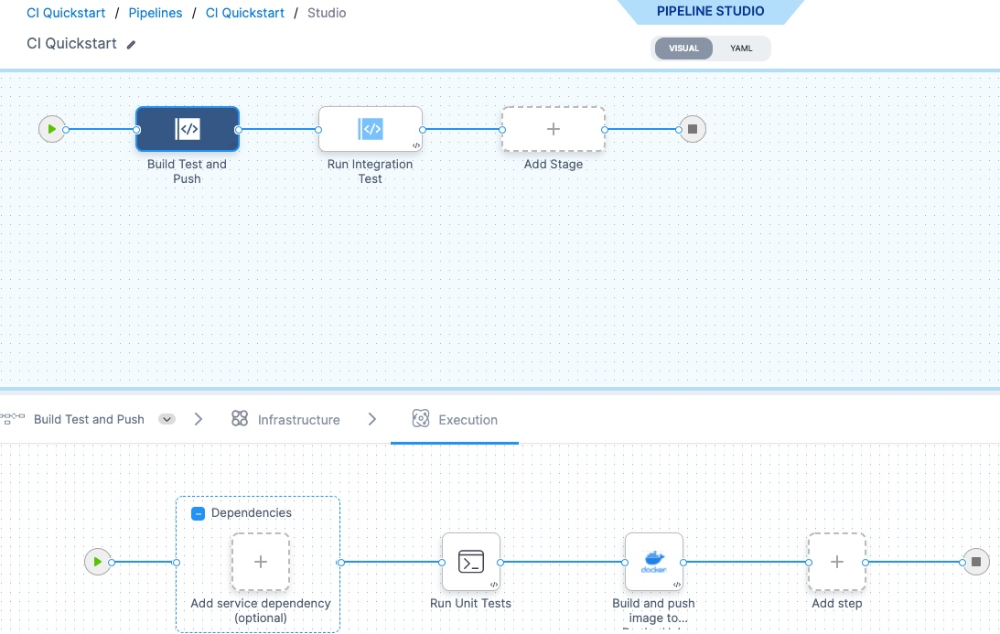
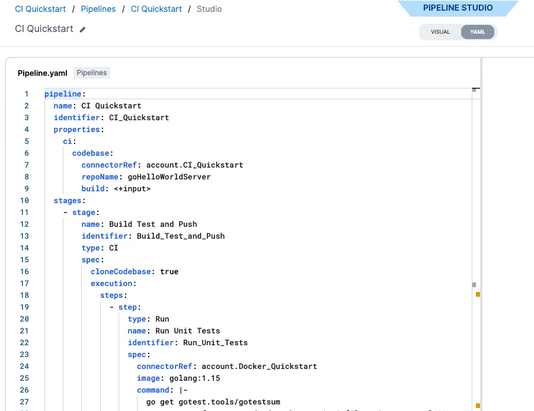

Before you [sign up for Harness](https://app.harness.io/auth/#/signup/) and start using Harness modules, you should be familiar with these key concepts.

## Projects

A Harness Project contains Harness pipelines, users, and resources that share the same goal. For example, a project could represent a business unit, division, or simply a development project for an app.

Projects are a shared space where teams can work independently on similar technologies without relying on account or org admins for new entities.

Much like account-level roles, project members can be assigned Project Admin, Member, and Viewer roles.

Project users have at least view access to all configuration and runtime data of a project and share the same assets (environments, services, infrastructure, and so on).

## Organizations

Harness Organizations (Orgs) allow you to group projects that share the same goal. For example, all projects for a business unit or division.

Within each org you can add several Harness Projects.

For more information, go to [Projects and Organizations](../platform/organizations-and-projects/projects-and-organizations.md).

## Account

A Harness account is the top-level entity, containing organizations and projects. Resources can be added at all levels, and are available to all lower levels. Teams can manage resources independently with projects, without relying on account admins.

## Product modules

Your project can add Harness products as modules, such as Continuous Integration or Continuous Delivery.

## Pipelines

Typically, a pipeline is an end-to-end process that delivers a new version of your software. But a pipeline can be much more: a pipeline can be a cyclical process that includes integration, delivery, operations, testing, deployment, real-time changes, and monitoring.

For example, a pipeline can use the CI module to build, test, and push code, and then a CD module to deploy the artifact to your production infrastructure.

## Pipeline Studio

You build pipelines in Pipeline Studio.

You can create pipelines visually or using code, and switch back and forth as needed.

|  |  |
| --- | --- |
| **Visual** | **YAML** |
|  |  |

For more information about YAML in Harness, go to [Write pipelines in YAML](../platform/pipelines/harness-yaml-quickstart.md).

Pipeline Studio guides you in setting up and running your pipelines with ready-to-use steps.

## Stages

A stage is a subset of a pipeline that contains the logic to perform one major segment of the pipeline process. Stages are based on the different milestones of your pipeline, such as building, approving, and delivering.

Some stages, like a deploy stage, use strategies that automatically add the necessary steps.

For more information, go to [Add a Stage](../platform/pipelines/add-a-stage.md).

## Steps and step groups

A step is an individual operation in a stage.

Steps can be run in sequential and parallel order.

A step group is a collection of steps that share the same logic such as the same rollback strategy.

For more information, go to [Run Steps in a Step Group](/docs/continuous-delivery/x-platform-cd-features/cd-steps/step-groups/).

## Services

A service represents your microservices and other workloads logically.

A service is a logical entity to be deployed, monitored, or changed independently.

### Service instance

Service instances represent the dynamic instantiation of a service you deploy via Harness.

For example, for a service representing a Docker image, service instances are the number of pods running with the Docker image.

### Service definitions

Service definitions are the actual files and variable values that represent the artifacts, manifests, and variables of a service. You can propagate and override a service by selecting its name in the subsequent stages' service settings.

For more information, go to [Monitor Deployments and Services in CD Dashboards](../continuous-delivery/monitor-deployments/monitor-cd-deployments.md).

## Environments

Environments represent your deployment targets logically (QA, Prod, etc). You can add the same environment to as many stages as you need.

### Infrastructure definition

Infrastructure definitions represent an environment's infrastructure physically. They are the actual clusters, hosts, etc.

## Connectors

Connectors contain the information necessary to integrate and work with 3rd party tools. Harness uses connectors at pipeline runtime to authenticate and perform operations with a third-party tool.

For example, a GitHub connector authenticates with a GitHub account and repo and fetches files as part of a build or deploy stage in a pipeline.

For more information, go to [Connectors](/docs/category/connectors).

## Secrets management

Harness includes built-in secrets management to store your encrypted secrets, such as access keys, and use them in your Harness account. Harness integrates with all popular secrets managers.

For more information, go to [Harness secrets management overview](/docs/platform/secrets/secrets-management/harness-secret-manager-overview).

## YAML and Git

You can sync your Harness account, orgs, and projects with your Git repo to manage Harness entirely from Git.

Harness can respond to Git events to trigger pipelines and pass in event data.

For more information, go to [Harness Git Experience overview](/docs/platform/git-experience/git-experience-overview/).

## Deployments

Deployments make developed artifacts available for use in test or production. They release applications for access by users or systems, and can be manual or automated. In Harness pipelines, deployments are modeled using services, environments, and execution steps.

For more information, go to [Deployment concepts and strategies](/docs/continuous-delivery/manage-deployments/deployment-concepts) and [Deploy services on different platforms](/docs/category/deploy-services-on-different-platforms).

## GitOps

GitOps is an approach to managing and automating deployment and management of infrastructure and applications using Git. The desired state of the apps and infrastructure is stored in a Git repo as code. Harness automation tools monitor the Git repo for changes and synchronize the actual state with the desired state.

For more information, go to [Harness GitOps basics](/docs/continuous-delivery/gitops/get-started/harness-git-ops-basics).

### Why are Deployments and GitOps different

In GitOps, changes are managed via Git files and Agents, without requiring pipelines. Deployments refer to executed pipelines in Harness.

This difference is why you see **Deployments** and **GitOps** separated in the Harness UI.
