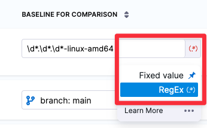

You need to specify a baseline for every target. The baseline represents the root variant, such as the `main` branch or the `latest` tag. In some cases, you might want to use the name of the latest official release as the baseline. Baselines make it easy to identify issues in the baseline vs. issues in a downstream variant derived from that baseline. 

To view all targets in your account, and specify baselines for your targets, go to **Security Tests** (left menu) and then **Test Targets**.

<figure>

<figcaption>Figure 1: <b>Test Targets</b> page</figcaption>

</figure>

## Specify dynamic baselines using regular expressions

<!-- 

:::note
Currently, this feature is behind the Feature Flag `STO_BASELINE_REGEX`. Contact [Harness Support](mailto:support@harness.io) to enable the feature.
:::

-->

In some cases, you might want to specify the name of the latest release for your target baseline. Suppose your organization publishes releases with names such as: 

* `3` , `3.17`, `3.17.3`, `3.18`, ...

* `1.14.6-linux-amd64`, `1.14.11-linux-amd64`, `1.15.4-linux-amd64`, ...

* `2023-02-29`, `2023-03-05`, `2023-03-12`, `2023-03-19`, ... 

With this cadence, the default baseline updates whenever you create a new release branch and scan it. In this case, you can use a regular expression (regex) to capture the latest release name and use it for the baseline.
 

Advantages of using regular expressions to define baselines

Defining your baselines using regular expressions provides significant benefits over using hard-coded strings such as `main` or `latest`. 

* Dynamic baselines more accurately reflect the current "root" element in the context of a real-world software development life cycle. A typical sprint cycle might run like this:
  
  - Publish the current release — for example, `1.2.3` — and merge this branch into `main`. 
  - Create a "next-release" branch — for example, `1.2.4` — from `main`.
  - Create branches from `1.2.4` for different features, hotfixes, and so on. 
  - When the release is ready to publish, merge the various branches into `1.2.4`. 
  - Publish the release, merge `1.2.4` into `main`, create a new release branch such as `1.2.5`, and repeat the cycle.

  Given this cadence, `1.2.4` more accurately reflects the baseline for the current sprint than  `main`. Given a matching regex, the first scan after creating the branch establishes `1.2.4` as the current baseline. This remains the current baseline until `1.2.4` gets merged into `main` and `1.2.5` gets created and scanned.

* Dynamic baselines make it easier to track the introduction and remediation of specific vulnerabilities. The lifecyle of a specific vulnerability might run like this:

   - A new release branch `1.2.3` is created. You scan this branch, which matches your regex, and it becomes the current baseline. 
   - The scan detects a new vulnerability, **vXYZ**, with a severity of MEDIUM.
   - A few sprints later, the vulnerability is remediated in a branch that gets merged into `1.2.7`.
   - `1.2.7` is scanned before getting merged into `main`, and **vXYZ** is no longer in the scan results. 

   <figure>

   

   <figcaption>Figure 2: Tracking a vulnerability across baselines</figcaption>

   </figure>

### Important notes for setting up target baselines in STO

* You must use a consistent naming scheme for your scanned targets. This is necessary to ensure that your regular expression captures your baselines consistently and predictably. 

* Carefully consider which targets you want to use for your baselines. In general, the baseline should be the root element for all your current variants. 

* When you specify a regular expression, the baseline is the *most recently scanned target* that matches the expression. 

* Use [re2 format](https://github.com/google/re2/wiki/Syntax) for your expressions. 

* Defining regular expressions is outside the scope of this documentation. Harness recommends that you test any regular expressions thoroughly to ensure that the expression matches any variant name that might be used for the scan target.

* STO includes a set of predefined regexes 

### Default regexes for projects and accounts

STO includes a set of default regexes automatically for new repository and container image targets:

- For repositories, the baseline is `master` or `main`.
- For container images, the baseline is `latest` or the highest two-dot version number if it can be detected, such as
  - `1.2.3` 
  - `1.15.4-linux-amd64` 
- STO does not include default regexes for application instances and configurations. 

You can specify your own default regexes for all four target types at the project or the account level:

- Go to **Project Settings** > **Default Settings** > **Security Testing Orchestration**
- Go to **Account Settings** > **Default Settings** > **Security Testing Orchestration**

### Specify a regex for an individual target

To override the default regex for an individual target, go to **Test Targets**. Then set the value type for the target to **RegEx** and enter the regex. 

### Regex examples

The following table shows a few simple examples of expressions for specific use cases.

<table>
    <tr>
        <th>Variant names</th>
        <th>Regular expression</th>
        <th>Description</th>
    </tr>
    <tr>
        <td>release-20230420  release-20230427   release-20230504   release-20230511    </td>
        <td valign="top"><code>release\-\d+</code></td>
        <td valign="top">
            <ul> 
                <li> Start with <code>release</code>, dash </li>
                <li> Follow with one or more digits   </li>
            </ul>
        </td>
    </tr>
    <tr>
        <td>code-v1.1   code-v1.2   code-v1.3   code-v2.1   code-v2.2   code-v20.31 </td>
        <td valign="top"><code>code\-v\d+\.\d*</code></td>
        <td valign="top">
            <ul>
                <li>Start with <code>code</code>, dash, <code>v</code> </li>
                <li>Follow with one or more digits, dot, one or more digits</li>
            </ul>
        </td>
    </tr>
    <tr>
        <td>1.14.6-linux-amd64  1.14.11-linux-amd64   1.15.4-linux-amd64 </td>
        <td valign="top"><code>\d*\.\d*\.\d*\-linux-amd64</code></td>
        <td valign="top">
            <ul>
                <li>Start with one or more digits, dot, one or more digits, dot, one or more digits</li>
                <li>Follow with hyphen, <code>linux-amd64</code> </li>
            </ul>
        </td>
    </tr>
    <tr>
        <td>3   3.17   3.17.3   3.18   3.18.12   30.142.1   30 </td>
        <td valign="top"><code>[\d.]+</code></td>
        <td valign="top">
            <ul>
                <li>Any combination of digits and dots </li>
            </ul>
        </td>
    </tr>
    <tr>
        <td>2023-02-11   2023-02-17   2023-02-23  </td>
        <td valign="top"><code>\d\d\d\d-\d\d\-\d\d</code></td>
        <td valign="top">
            <ul>
                 <li>
                    Four digits, dash, two digits, dash, two digits 
                </li>
            </ul>
        </td>
    </tr>
</table>
